# MonKeys

## Страницы тестирования

* [Лента](#Feed) (Л)
  * Кнопка раскрыть
* [Лайки](#Like) (Л)

* [Совпадения](#Match) (В)
* [Чаты](#Chats) (В)

* [Регистрация](#Signup) (М)
* [Логин](#Login) (М)
* [Тапбар](#Tapbar) (М)
  
* [Профиль](#Profile) (И)
* [Настройки и создание профиля](#Settings) (И)

###  Лента

* Карточка в ленте (расширенная)
  * ✅ При нажатии на кнопку "Лайк" карточка улетает вправо и ставится лайк, открывается следующая карточка в нерасширенном состоянии
  * ✅ При нажатии на кнопку "Дизлайк" карточка улетает влево и ставится дизлайк
  * ✅ При нажатии на кнопку уменьшить открывается расширенная версия карточки
  * ✅ При нажатии на кнопку пожаловаться открывается меню с возможнными жалобами
  * ❌ При нажатии на кнопку пожаловаться на пк версии неправильно отрисовывается меню с возможными жалобами
    
    Баг: Отрисовка жалоб в ленте на пк
    

    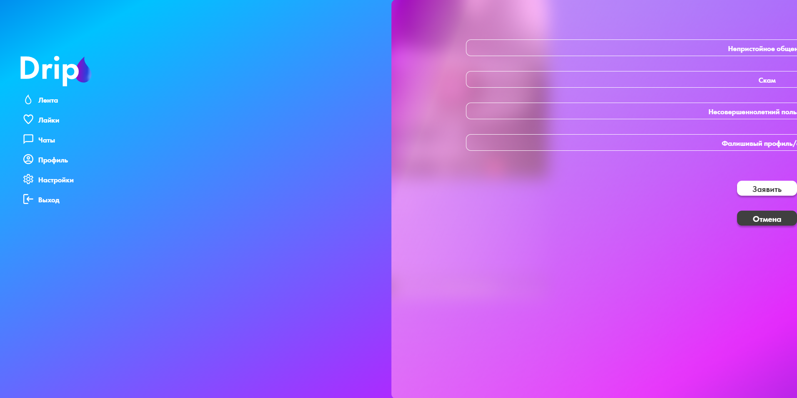
    

  * ✅ При окончании карточек в ленте отображается сообщение об окончании карточек в ленте
  
* Меню жалоб
  * ✅ При нажатии на пункты меню подсвечивается выбранный вариант
  * ✅ При нажатии на кнопку заявить при отсуствии выбранного типа жалобы ничего не происходит
  * ✅ При нажатии на кнопку заявить при выбранном типе жалобы отправляется заявка
  * ✅ При нажатии на кнопку отмена меню сворачивается

* Карусель (расширенная карточка)
  * ✅ При наличии у карточки одной фотографии стрелочки и верхний селектор не отображаются
  * ✅ При нахождении на крайней правой фотографии кнопка вправо исчезает
  * ✅ При нахождении на крайней левой фотографии кнопка влево исчезает
  * ✅ При нажатии на кнопку "Раскрыть" в раскрытой карточке не меняется выбор текущей фотографии
  * ✅ При нажатии на кнопку "Уменьшить" в уменьшенной карточке не меняется выбор текущей фотографии

* Свайпы
  * ✅ При движении карточки вправо ставится лайк
  * ✅ При движении карточки влево ставится дизлайк
  * ❌ При движении карточки вверх и выходе курсора за границы окна карточка застревает в экране
    
    Баг: Карточка не возвращается назад
    

    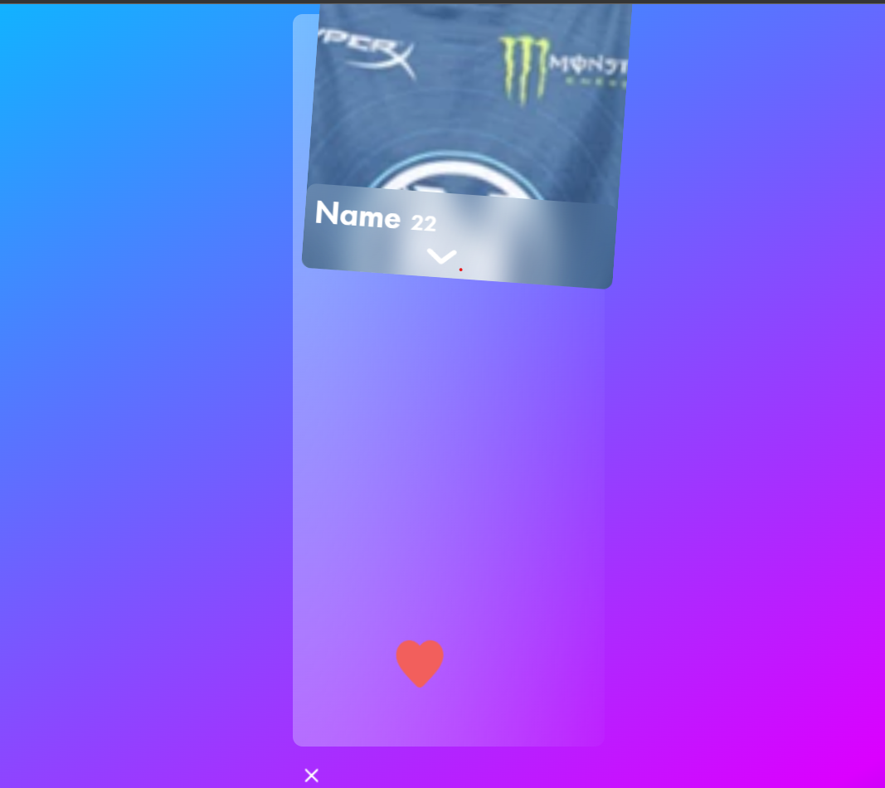
    

  * ❌ При движении карточки вниз и выходе курсора за границы окна карточка застревает в экране
    
    Баг: Карточка не возвращается назад
    

    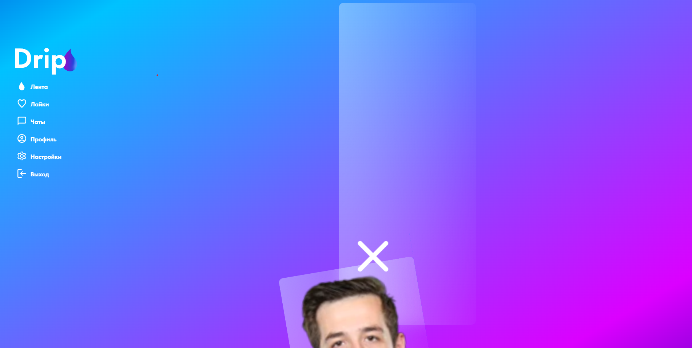
    

  * ✅ При нахождении на крайней правой фотографии кнопка вправо исчезает
  * ✅ При нахождении на крайней левой фотографии кнопка влево исчезает
  * ✅ При нажатии на кнопку "Раскрыть" в раскрытой карточке не меняется выбор текущей фотографии
  * ✅ При нажатии на кнопку "Уменьшить" в уменьшенной карточке не меняется выбор текущей фотографии

###  Лайки

* Для пользователя с подпиской (список "Вы понравились нескольким людям")
  * ✅ При свайпе влево карточки не крутятся дальше при достижении первой
  * ✅ При свайпе вправо карточки не крутятся дальше при достижении последней
  * ✅ При нажатии на кнопку "Лайк" на одной из карточек она пропадает из списка
  * ✅ При нажатии на кнопку "Дизлайк" на одной из карточек она пропадает из списка
  * ✅ При нажатии на кнопку расширить открывается расширенная версия карточки
  * ✅ При реакции на последнюю карточку отображается сообщение о конце лайков
  * ✅ При отсутсвии лайков отображается сообщение о конце лайков

* Для пользователя без подписки
  * ✅ При нажатии на выбор один из пунктов меню он подсвечивается
  * ✅ При нажатии кнопки оплатить выполняется переход на ЮMoney для последующей оплаты в соответсвии с выбранным типом подписки

###  Совпадения

###  Чаты

###  Регистрация
* Поле "Почта"
  * ✅ При начале ввода под полем появляется подсказка о формате ввода
  * ✅ При начале ввода данные валидируются (поле окрашивается в красный тон)
  * ✅ При успешном вводе должна пропасть подсказка
  * ✅ При успешном вводе цвет поля должен вернуться в изначальный
  * ✅ При успешном вводе в конце поля должна появиться зеленая галочка
  * ❌ В поле должна валидироваться почта  
  БАГ: валидацию проходят емейлы вида: test@r, tes`t@mail.ru
    

    
    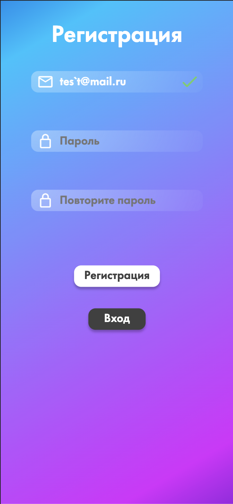 

  * ✅ После ввода при анфокусе подсказка под полем окрашиваeтся в красный цвет
  * ✅ При копировании в поле должна работать валидация  
* Поле "Пароль"
  * ✅ При начале ввода под полем появляется подсказка о формате ввода
  * ✅ При начале ввода данные валидируются (поле окрашивается в красный тон)
  * ✅ При успешном вводе должна пропасть подсказка
  * ✅ При успешном вводе цвет поля должен вернуться в изначальный
  * ✅ При успешном вводе в конце поля должна появиться зеленая галочка
  * ❌ Подсказка сообщает, что пароль должен быть не короче 8 символов: "Введите пароль (не менее 8 символов)"  
  БАГ: подсказка с неправильным текстом: "Пароль должен состоять из A-Z, a-z и 0-9 (не менее 8 символов)"
    

    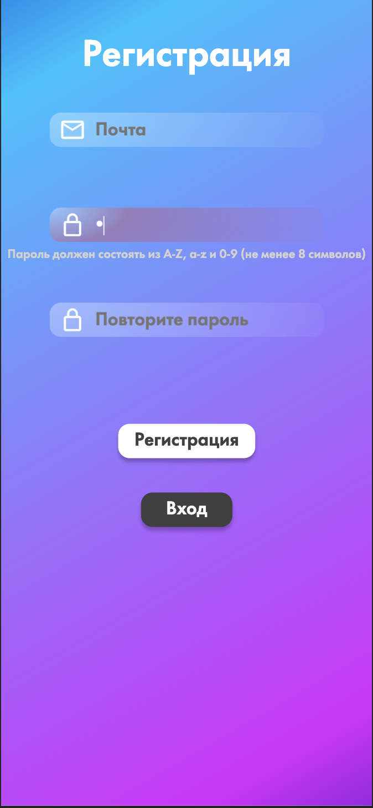 

  * ✅ При копировании в поле должна работать валидация
* Поле "Повторите пароль"
  * ✅ При начале ввода под полем появляется подсказка о несовпадении паролей
  * ✅ При начале ввода поле окрашивается в красный тон, сигнализируя о несовпадении паролей
  * ✅ При успешном вводе должна пропасть подсказка
  * ✅ При успешном вводе цвет поля должен вернуться в изначальный
  * ✅ При успешном вводе в конце поля должна появиться зеленая галочка
  * ✅ При копировании в поле должна работать валидация
  * ❌ Введенный пароль валидируется на совпадение с паролем из поля "Пароль"  
  БАГ: при полном стирании пароля из поля "Повторите пароль" и вводе одного произвольного символа в поле "Пароль" поле "Повторите пароль" отображается как успешно пройденное валидацию
    

    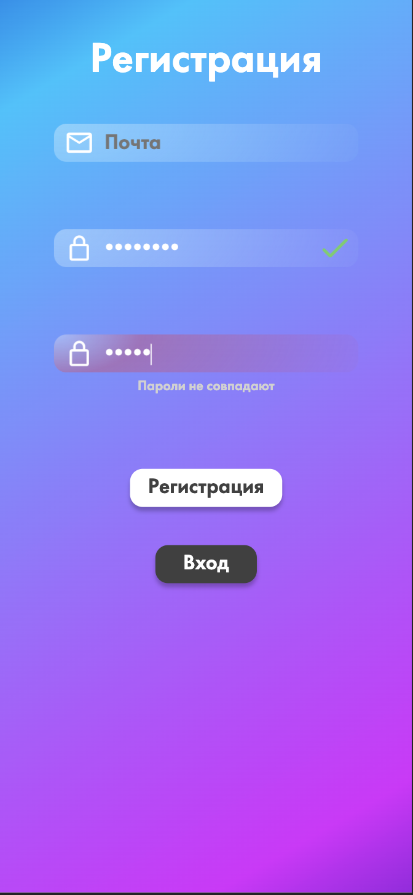
    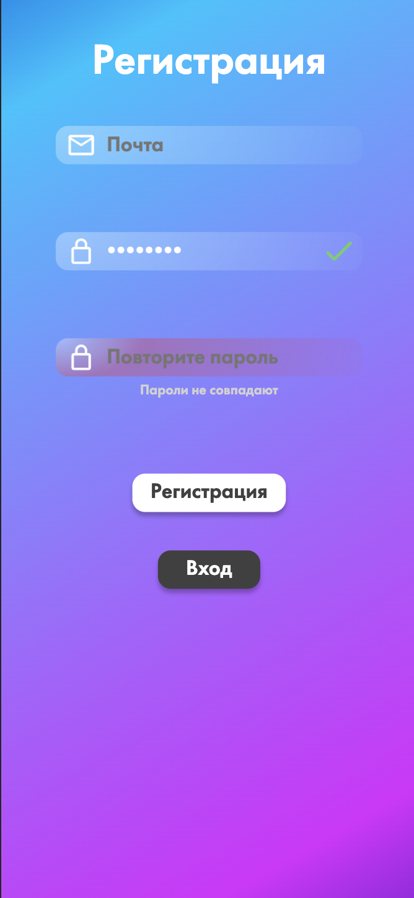
    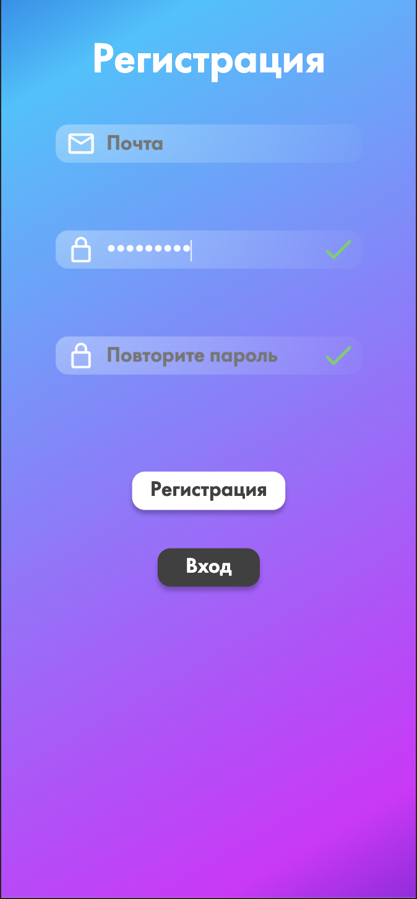 

  * Кнопка "Регистрация"
    * ✅ При нажатии с незаполненной почтой под полем "Почта" появляется красная подсказка: "Введите почту в формате example@drip.com"
    * ✅ При нажатии с незаполненной почтой поле "Почта" окрашивается в красный
    * ✅ При нажатии с незаполненным паролем под полем "Пароль" появляется красная подсказка
    * ✅ При нажатии с незаполненным паролем поле "Пароль" окрашивается в красный
    * ✅ При нажатии с незаполненным повторным паролем под полем "Повторите пароль" появляется красная подсказка
    * ✅ При нажатии с незаполненным повторным паролем поле "Повторите пароль" окрашивается в красный
    * ✅ При ошибке валидации полей запрос на регистрацию не отправляется
    * ✅ При регистрации пользователя с уже зарегистрированной почтой появляется текстовая ошибка краснаого цвета над кнопкой: "Пользователь с такой почтой уже зарегистрирован" 
    * ✅ При регистрации с валидными данными открывается страницы заполнения профиля
  * Кнопка "Вход"
    * ✅ Открывается страница с формой логина

* ###  Логин
  * Поле "Почта"
    * ✅ При начале ввода под полем появляется подсказка о формате ввода
    * ✅ При начале ввода данные валидируются (поле окрашивается в красный тон)
    * ✅ При успешном вводе должна пропасть подсказка
    * ✅ При успешном вводе цвет поля должен вернуться в изначальный
    * ✅ При успешном вводе в конце поля должна появиться зеленая галочка
    * ❌ В поле должна валидироваться почта  
    БАГ: валидацию проходят емейлы вида: test@r, tes`t@mail.ru
      

      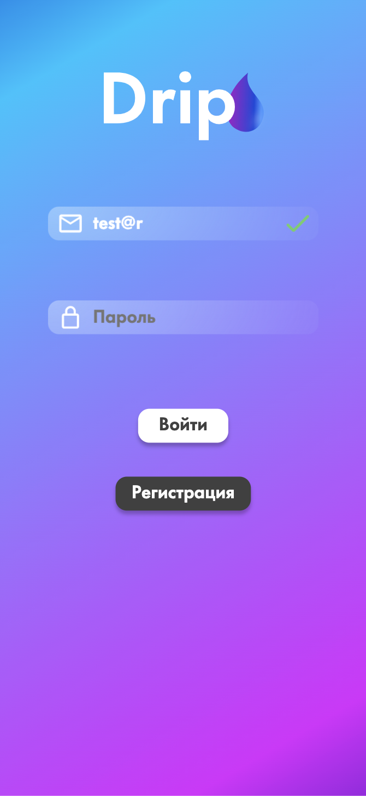
      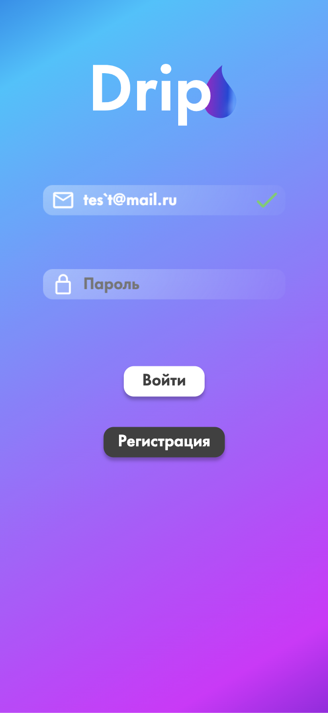 

    * ✅ После ввода при анфокусе подсказка под полем окрашиваeтся в красный цвет
    * ✅ При копировании в поле должна работать валидация
  * Поле "Пароль"
    * ✅ При начале ввода под полем появляется подсказка о формате ввода
    * ✅ При начале ввода данные валидируются (поле окрашивается в красный тон)
    * ✅ При успешном вводе должна пропасть подсказка
    * ✅ При успешном вводе цвет поля должен вернуться в изначальный
    * ✅ При успешном вводе в конце поля должна появиться зеленая галочка
    * ❌ Подсказка сообщает, что пароль должен быть не короче 8 символов: "Введите пароль (не менее 8 символов)"  
    БАГ: подсказка с неправильным текстом: "Пароль должен состоять из A-Z, a-z и 0-9 (не менее 8 символов)"
      

      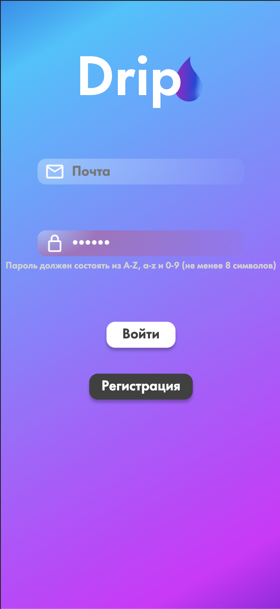 

    * ✅ При копировании в поле должна работать валидация
  * Кнопка "Войти"
    * ✅ При нажатии с незаполненной почтой под полем "Почта" появляется красная подсказка: "Введите почту в формате example@drip.com"
    * ✅ При нажатии с незаполненной почтой поле "Почта" окрашивается в красный
    * ✅ При нажатии с незаполненным паролем под полем "Пароль" появляется красная подсказка
    * ✅ При нажатии с незаполненным паролем поле "Пароль" окрашивается в красный
    * ✅ При ошибке валидации полей запрос на логин не отправляется
    * ✅ При входе незарегистрированного пользователя появляется ошибка красного цвета над кнопкой: "Неверная почта или пароль" 
    * ✅ При входе с неправильным пароле появляется ошибка красного цвета над кнопкой: "Неверная почта или пароль"
    * ✅ При входе c валидными данными открывается страницы ленты
  * Кнопка "Регистрация"
    * ✅ Открывается страница с формой регистрации

###  Навбар
* ✅ При нажатии на кнопку "Капля" открывается страница ленты
* ✅ При нажатии на кнопку "Сердце" открывается страница лайков
* ✅ При нажатии на кнопку "Чат" открывается страница чатов и метчей
* ✅ При нажатии на кнопку "Профиль" открывается страница профиля
###  Профиль
  * ✅ Кнопка выхода
  * ✅ Кнопка настроек
  * ✅ Кнопка следующей изображения профиля

###  Настройки и создание профиля
* Поле "Имя"
    * ✅ При слишком длинном вводе снизу выводится сообщение об ошибке (выделено красным)
    * ✅ При пустом вводе снизу выводится сообщение об ошибке (выделено красным)
    * ✅ После не валидного ввода при анфокусе цвет поля темнеет
    * ✅ При успешном вводе цвет поля должен вернуться в изначальный
    * ✅ При копировании в поле должна работать валидация
* Поле "Дата рождения"
    * ✅ При пустом вводе хотя бы одного поля даты снизу выводится сообщение об ошибке (выделено красным)
    * ✅ При введении в поле дня больше 31 снизу выводится сообщение об ошибке (выделено красным)
    * ✅ При введении в поле месяца больше 12 снизу выводится сообщение об ошибке (выделено красным)
    * ✅ При введении в поле дня больше текущего года снизу выводится сообщение об ошибке (выделено красным)
    * ✅ При введении нулей в любое поле снизу выводится сообщение об ошибке (выделено красным)
    * ✅ При введении даты на 100 лет меньшей текущей снизу выводится сообщение об ошибке (выделено красным)
    * ✅ После не валидного ввода при анфокусе цвет поля темнеет
    * ✅ При успешном вводе цвет поля должен вернуться в изначальный
    * ✅ При копировании в поле должна работать валидация
    * ❌ Валидируется поле день при вводе 31 при месяцах с 30 днями, а также 29 февраля
    БАГ: валидацию проходят емейлы вида: 31 04 2021, 29 02 2021
      

      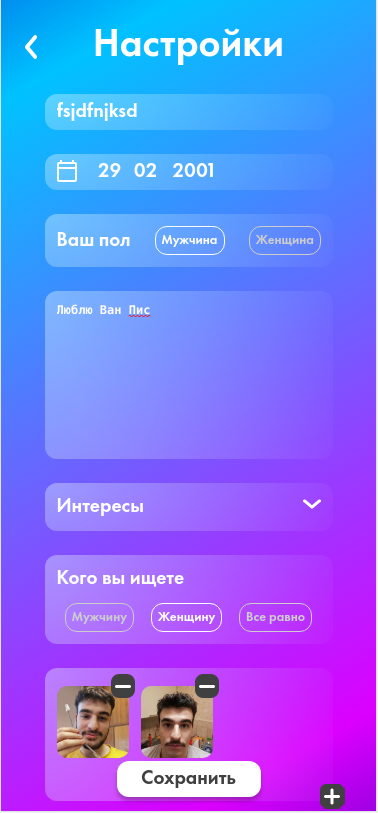
      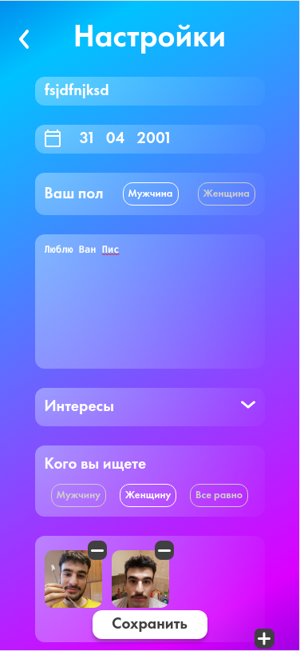 

* Поле "Ваш возраст"
    * ✅ При нажатии на одно из селектов другой тускнеет
* Поле "Расскажите о себе"
    * ✅ При пустом вводе ошибка не выдается
    * ✅ При нажатие на кнопку "Сохранить" во вкладке профиль поле изменяется остальные остаются неизменными
* Поле "Расскажите о себе"
    * ✅ При нажатии на кнопку раскрытия интересов раскрываются сохраненные интересы
    * ✅ При изменении интересов, свертывании и обратном развертывании изменения остаются
* Поле "Кого вы ищите"
    * ✅ При нажатии на одно из селектов другой тускнеет
* Поле "Аватары"
    * ✅ Невозможно удалить изображение, если она одна
    * ✅ Невозможно сохранить форму, если нет изображений
    * ❌ При большом количестве фотографий, сохраняется форма
    БАГ: только после удаления всех фоток или обновления страницы можно продолжить пользоваться приложением
      

      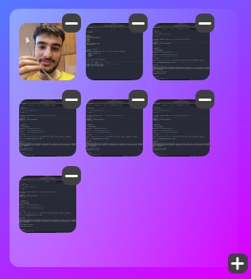 

    * ❌ Закономернсоти не найдено 
    БАГ: невозможно добавить еще одну фотографию
      

      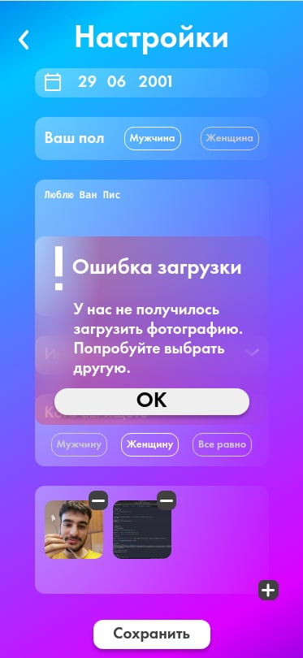 

* Кнопка "Сохранить"
    * ✅ При не валидных данных, подсвечивются все невалидные поля, а также текста ошибок под ними
    * ✅ Все измененные поля во вкладке профиле изменяются успешно, остальные остаются неизменными
