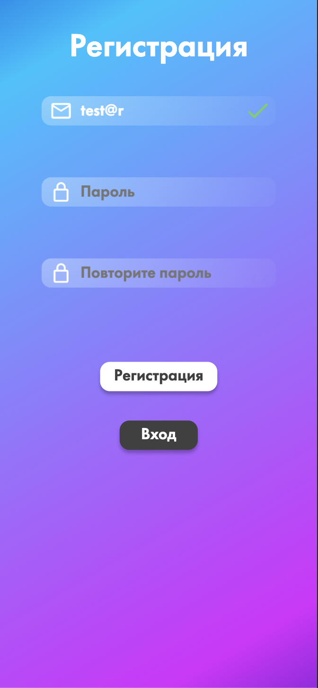

# MonKeys

## Страницы тестирования

* [Лента](#Feed) (Л)
  * Кнопка раскрыть
* [Лайки](#Like) (Л)

* [Совпадения](#Match) (В)
* [Чаты](#Chats) (В)

* [Регистрация](#Signup) (М)
* [Логин](#Login) (М)
* [Тапбар](#Tapbar) (М)
  
* [Профиль](#Profile) (И)
* [Настройки и создание профиля](#Settings) (И)

###  Лента

#### &emsp;Кнопка раскрыть

#### &emsp;&emsp;Позитивные
##### &emsp;&emsp;&emsp;Нажатие на центральную кнопку на карточке должно открыть подробное описание

 

##### &emsp;&emsp;&emsp;После нажатия открывается подробное описание

 

#### &emsp;&emsp;Негативные

###  Лайки

###  Совпадения

###  Чаты

###  Регистрация
* Поле "Почта"
  * ✅ При начале ввода под полем появляется подсказка о формате ввода
  * ✅ При начале ввода данные валидируются (поле окрашивается в красный тон)
  * ✅ При успешном вводе должна пропасть подсказка
  * ✅ При успешном вводе цвет поля должен вернуться в изначальный
  * ✅ При успешном вводе в конце поля должна появиться зеленая галочка
  * ❌ В поле должна валидироваться почта  
  БАГ: валидацию проходят емейлы вида: test@r, tes`t@mail.ru
    

    
     

  * ✅ После ввода при анфокусе подсказка под полем окрашиваeтся в красный цвет
  * ✅ При копировании в поле должна работать валидация  
* Поле "Пароль"
  * ✅ При начале ввода под полем появляется подсказка о формате ввода
  * ✅ При начале ввода данные валидируются (поле окрашивается в красный тон)
  * ✅ При успешном вводе должна пропасть подсказка
  * ✅ При успешном вводе цвет поля должен вернуться в изначальный
  * ✅ При успешном вводе в конце поля должна появиться зеленая галочка
  * ❌ Подсказка сообщает, что пароль должен быть не короче 8 символов: "Введите пароль (не менее 8 символов)"  
  БАГ: подсказка с неправильным текстом: "Пароль должен состоять из A-Z, a-z и 0-9 (не менее 8 символов)"
    

     

  * ✅ При копировании в поле должна работать валидация
* Поле "Повторите пароль"
  * ✅ При начале ввода под полем появляется подсказка о несовпадении паролей
  * ✅ При начале ввода поле окрашивается в красный тон, сигнализируя о несовпадении паролей
  * ✅ При успешном вводе должна пропасть подсказка
  * ✅ При успешном вводе цвет поля должен вернуться в изначальный
  * ✅ При успешном вводе в конце поля должна появиться зеленая галочка
  * ✅ При копировании в поле должна работать валидация
  * ❌ Введенный пароль валидируется на совпадение с паролем из поля "Пароль"  
  БАГ: при полном стирании пароля из поля "Повторите пароль" и вводе одного произвольного символа в поле "Пароль" поле "Повторите пароль" отображается как успешно пройденное валидацию
    

    
    
     

  * Кнопка "Регистрация"
    * ✅ При нажатии с незаполненной почтой под полем "Почта" появляется красная подсказка: "Введите почту в формате example@drip.com"
    * ✅ При нажатии с незаполненной почтой поле "Почта" окрашивается в красный
    * ✅ При нажатии с незаполненным паролем под полем "Пароль" появляется красная подсказка
    * ✅ При нажатии с незаполненным паролем поле "Пароль" окрашивается в красный
    * ✅ При нажатии с незаполненным повторным паролем под полем "Повторите пароль" появляется красная подсказка
    * ✅ При нажатии с незаполненным повторным паролем поле "Повторите пароль" окрашивается в красный
    * ✅ При ошибке валидации полей запрос на регистрацию не отправляется
    * ✅ При регистрации пользователя с уже зарегистрированной почтой появляется текстовая ошибка краснаого цвета над кнопкой: "Пользователь с такой почтой уже зарегистрирован" 
    * ✅ При регистрации с валидными данными открывается страницы заполнения профиля
  * Кнопка "Вход"
    * ✅ Открывается страница с формой логина

* ###  Логин
  * Поле "Почта"
    * ✅ При начале ввода под полем появляется подсказка о формате ввода
    * ✅ При начале ввода данные валидируются (поле окрашивается в красный тон)
    * ✅ При успешном вводе должна пропасть подсказка
    * ✅ При успешном вводе цвет поля должен вернуться в изначальный
    * ✅ При успешном вводе в конце поля должна появиться зеленая галочка
    * ❌ В поле должна валидироваться почта  
    БАГ: валидацию проходят емейлы вида: test@r, tes`t@mail.ru
      

      
       

    * ✅ После ввода при анфокусе подсказка под полем окрашиваeтся в красный цвет
    * ✅ При копировании в поле должна работать валидация
  * Поле "Пароль"
    * ✅ При начале ввода под полем появляется подсказка о формате ввода
    * ✅ При начале ввода данные валидируются (поле окрашивается в красный тон)
    * ✅ При успешном вводе должна пропасть подсказка
    * ✅ При успешном вводе цвет поля должен вернуться в изначальный
    * ✅ При успешном вводе в конце поля должна появиться зеленая галочка
    * ❌ Подсказка сообщает, что пароль должен быть не короче 8 символов: "Введите пароль (не менее 8 символов)"  
    БАГ: подсказка с неправильным текстом: "Пароль должен состоять из A-Z, a-z и 0-9 (не менее 8 символов)"
      

       

    * ✅ При копировании в поле должна работать валидация
  * Кнопка "Войти"
    * ✅ При нажатии с незаполненной почтой под полем "Почта" появляется красная подсказка: "Введите почту в формате example@drip.com"
    * ✅ При нажатии с незаполненной почтой поле "Почта" окрашивается в красный
    * ✅ При нажатии с незаполненным паролем под полем "Пароль" появляется красная подсказка
    * ✅ При нажатии с незаполненным паролем поле "Пароль" окрашивается в красный
    * ✅ При ошибке валидации полей запрос на логин не отправляется
    * ✅ При входе незарегистрированного пользователя появляется ошибка красного цвета над кнопкой: "Неверная почта или пароль" 
    * ✅ При входе с неправильным пароле появляется ошибка красного цвета над кнопкой: "Неверная почта или пароль"
    * ✅ При входе c валидными данными открывается страницы ленты
  * Кнопка "Регистрация"
    * ✅ Открывается страница с формой регистрации

###  Навбар
* ✅ При нажатии на кнопку "Капля" открывается страница ленты
* ✅ При нажатии на кнопку "Сердце" открывается страница лайков
* ✅ При нажатии на кнопку "Чат" открывается страница чатов и метчей
* ✅ При нажатии на кнопку "Профиль" открывается страница профиля
###  Профиль

###  Настройки и создание профиля
