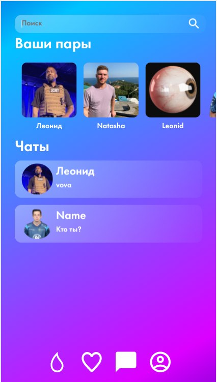

# MonKeys

## Страницы тестирования

* [Лента](#Feed) (Л)
  * Кнопка раскрыть
* [Лайки](#Like) (Л)

* [Совпадения](#Match) (В)
* [Чаты](#Chats) (В)

* [Регистрация](#Signup) (М)
* [Логин](#Login) (М)
* [Тапбар](#Tapbar) (М)
  
* [Профиль](#Profile) (И)
* [Настройки и создание профиля](#Settings) (И)

###  Лента

#### &emsp;Кнопка раскрыть

#### &emsp;&emsp;Позитивные
##### &emsp;&emsp;&emsp;Нажатие на центральную кнопку на карточке должно открыть подробное описание

 

##### &emsp;&emsp;&emsp;После нажатия открывается подробное описание

 

#### &emsp;&emsp;Негативные

###  Лайки

###  Совпадения

* Поле "Поиск"
  * ✅ При вводе символов, в списке совпадений отображаются совпадения с таким вхождением
  * ❌ После удаления введенных символов в поиск, список совпадений должен иметь прежний вид

      БАГ: пропадает выделение новых совпадений
  
      |до ввода текста в поле "Поиск"|После удаления симоволов из поля "Поиск"|
      |----|----|
      |||

* Список совпадений
  * ✅ При нажатии на совпадение открывается чат
  * ✅ Совпадения с людьми, с которыми еще нет чата, подсвечиваются как новые
  * ✅ При нажатии на новое совпадение, оно перестаеит подсвечиваться и открывается чат

###  Чаты

* ✅ При нажатии на превью чата открывается чат

###  Регистрация

###  Логин

###  Тапбар

###  Профиль

###  Настройки и создание профиля
